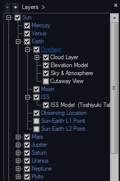
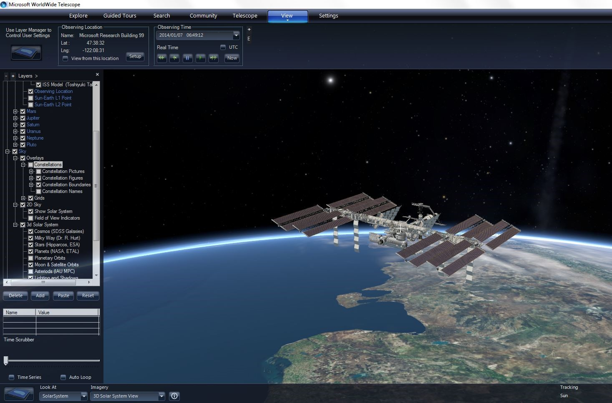
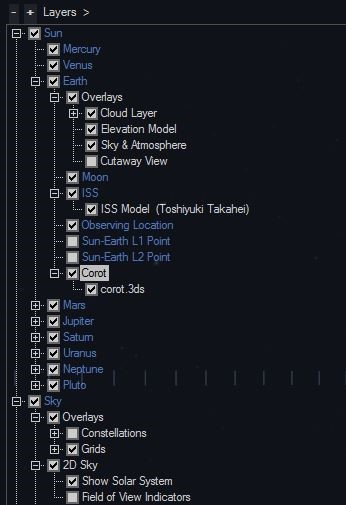

+++
title = "3D Models"
weight = 300
+++

AAS WorldWide Telescope can display 3D models of spacecraft, asteroids, and
other objects.

# The International Space Station

A large an exquisitely detailed model of the International Space Station
(ISS), created by Toshiyuki Takahei, is built in to WWT.

* Open up the Layer Manager (click View, Show Layer Manager)
* Open Earth node, then ISS node and click on ISS Model
  * The first time you do this, WWT will silently download the model so it may
    take a little while to show up depending on your internet connection.
    
* Right click on the ISS Reference Frame (not the ISS Model) and click Track
  this Frame
  *  If the ISS model has completed downloading, you should see the model in
     orbit around Earth (pan around a little if you don’t see it right away).
     
* Try turning on Observing Time (View button) and you’ll see the space station
  orbiting in its actual orbit around Earth! WWT automatically pulls
  information about the ISS's current orbit from the internet.

# Prepackaged 3D Models

It is possible to prepare a 3D model embedded in a WWT Layers file with
correct orbital information. An example for the Corot spacecraft is available
[from this link](http://wwtweb.blob.core.windows.net/assets/3d/corot.wwtl) (12
MiB download).

* Click on the Corot link which will download the Corot Model in a WWT Layer
* Open the Corot Layer File (either by double clicking on the file or clicking
  Explore – Open – Layer)
  * The 3D Model will be loaded in the Reference Frame in which it was saved
    
* If the Layer Manager is not already open, ensure it is opened (View – Show
  Layer Manager)
* Navigate through the Layer Manager to see the Reference Frame (for Corot:
  Earth – Corot)
* Right click on Corot Reference Frame and click Track this Frame
  *  WWT will jump to the Corot 3D Model

Try turning on Observing Time (View button) and you’ll see Corot orbiting in
its actual orbit around Earth!

# Other 3D Models

WWT can display generic 3D models in `.obj` and `.3ds` formats using the Layer
Manager. The section on [Orbits](@/orbits/index.md) contains some examples.
