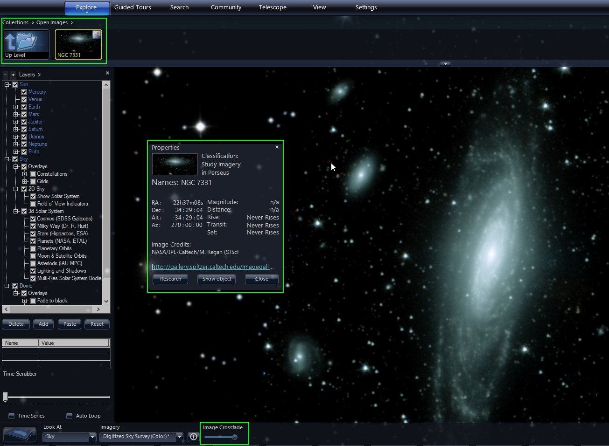
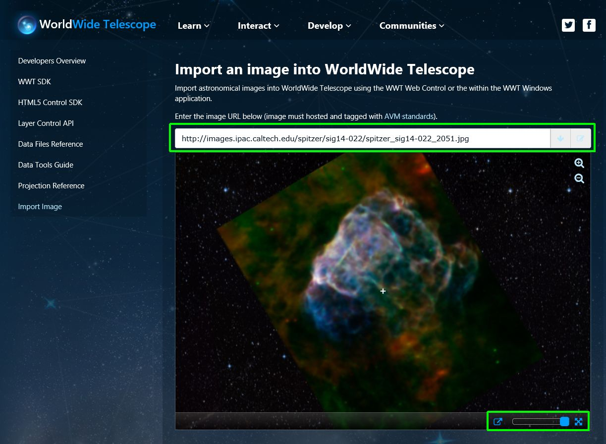
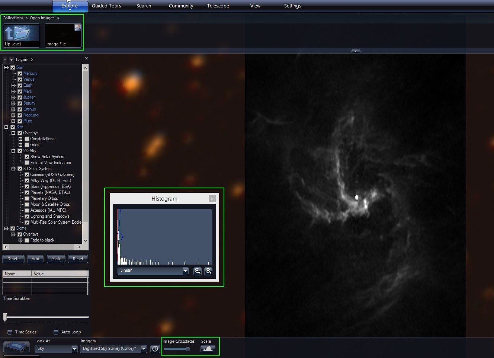

+++
title = "Astronomical Image Data Layers"
weight = 100
+++

Astronomical images, defined as those with sky coordinate metadata, can be
loaded directly into AAS WorldWide Telescope (WWT) in several ways.

# Loading Local AVM-tagged Images

[Astronomical Visualization Metadata][avm] (AVM) is a way to storing
information about the original astronomical image in the header of a standard
image file, such as TIFF and JPEG. This standard uses existing header
infrastructure and populates it with astronomy-specific metadata. The relevant
metadata to WWT is:

* Image Name
* URL
* Credits
* Caption
* World Coordinate System (WCS) coordinate information

[avm]: http://www.virtualastronomy.org/avm_metadata.php

The idea behind AVM is to allow visualizers to manipulate colors, add
annotations etc. and maintain the description of that manipulation – e.g.,
original data location, color representation – so that subsequent people know
how it was created and how to interpret it. For WWT, coordinates allow the
image to be placed at the correct location on the sky.

You can download AVM-tagged data from a variety of data sources. If your
favorite source of image data provider doesn’t currently include AVM tags, you
can direct them to the AVM resources below. If you want to get a test image,
you can browse for one on the [Astropix](https://astropix.ipac.caltech.edu/)
website, which aggregates AVM-tagged images. Once you have it, you can add the
data to WWT by:

1. Make sure you are in Sky Mode.
2. Under the Explore Tab, click on Open/Astronomical Image…
3. Browse to the appropriate file.
4. WWT will load the data into WWT and add it to a default collection called
   “Open Collections,” shown in the upper left-hand part of WWT. You can right
   click and add it to a collection of your choice for image organization
   after you have loaded it.
5. You can right-click on the image in the collection and select “Properties”
   to see the image, coordinates, image name, caption, URL. These values are
   all pulled from the AVM tags when the file is read.
6. You can adjust the cross-fader to change the opacity of this overlaid image
   on top of the current background.
7. You can also adjust the Image Alignment by pressing CTRL+E to open the
   Image Alignment instructions.

# Loading Remotely-served AVM-tagged Images

In a similar fashion, you can point your browser to an AVM-tagged image on the
Internet and it will show the image in your browser in a similar overlay using
web controls, with a link to view the image in WWT. Clicking this send this
image to the WWT desktop client and allows display control and exploration,
similar to interaction with local AVM-tagged Images, above. You can try this
out for yourself.

1. Open the following URL in your browser:
   <http://www.worldwidetelescope.org/GetInvolved/ImportImage>.
2. Paste the URL to this composite X-ray and Infrared image of Puppis A, which
   has already been AVM-tagged into the Image URL input field on the webpage:
   <http://images.ipac.caltech.edu/spitzer/sig14-022/spitzer_sig14-022_2051.jpg>.
3. This will open the image the webpage with control over image cross-fade and
   full-screen in the lower right. You can also click the button to the left
   of the cross-fader which opens the image in the WWT desktop client.

# Loading FITS Files

1. Make sure you are in Sky Mode.
2. Under the Explore Tab, click on Open/Astronomical Image…
3. Browse to the appropriate FITS data file. This can be pulled from the
   Internet or from an attached telescope or a local file.
4. WWT will load the FITS file into WWT and add it to a default collection
   called “Open Collections,” shown in the upper left-hand part of WWT. You
   can right click and add it to a collection of your choice for image
   organization after you have loaded it.
5. Note that FITS files contain pixels, which are mapped to physical
   coordinates, and data values. To view the image data values must be mapped
   to colors. The default color map is a linear greyscale one where the lowest
   value is mapped to black and the highest to white, with linear steps in
   between. You can interactively adjust this mapping by clicking on the Scale
   button, which opens the Histogram dialog box.
6. In the Histogram dialog you can select the mapping function between Linear,
   Log, Power, Square Root and Histogram Equalization.
7. You can change the minimum and maximum data ranges by moving the red and
   green vertical lines, respectively. If you move the green line to the left
   of the red line, this inverts the mapping and low values will be show white
   and high values black.
8. Grabbing the blue circle in the middle will allow you to keep the mapping
   function width of the function and move it through the histogram left and
   right.
9. You can adjust the cross-fader to change the opacity of this overlaid image
   on top of the current background.

