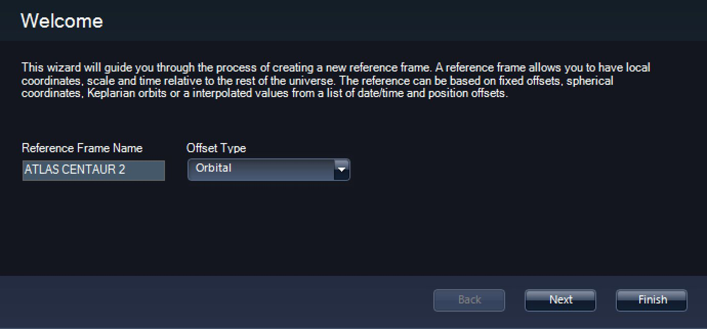
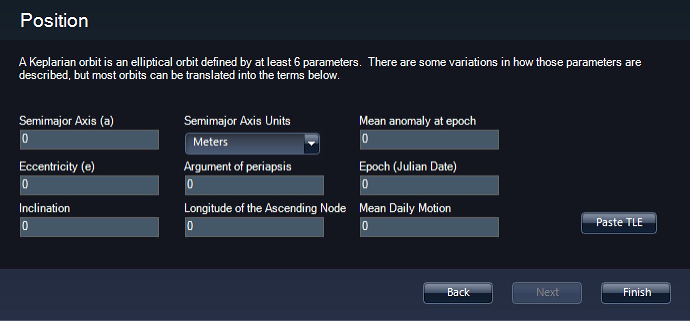
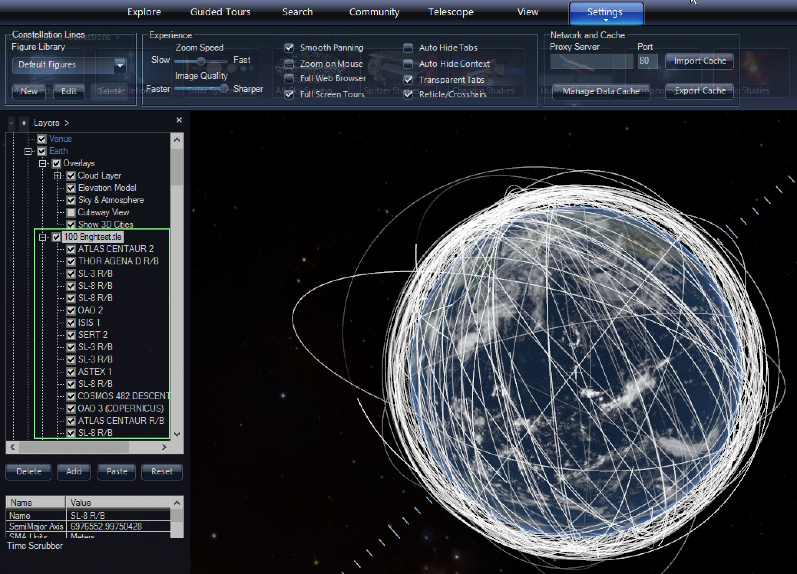
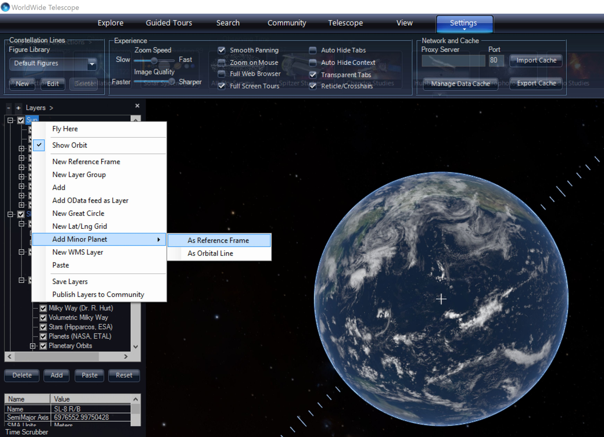

+++
title = "Satellite and Minor Planet Orbits"
weight = 200
+++

WorldWide Telescope (WWT) allows for a variety of bodies in the Solar System
to be represented by orbital lines with and by 3D representations (planets or
spacecraft models).

* Planets
* Moons
* Asteroids
* Satellites from Two-Line Elements (TLE)
* Minor Planets from Minor Planet Center (MPC)
* User-defined trajectories and orbits

In all these cases the motion is rendered correctly the desired rate of the
passage of time showing orbital motions. Below are instructions showing how to
input user defined data and data from data sources outside WWT.


# Satellites from Two-Line Element set (TLE)

Satellites orbits are often represented in a compressed format called a
two-line element set (TLE). Below is an example TLE.

```
ATLAS CENTAUR 2
1 00694U 63047A   16133.33455413  .00000915  00000-0  10743-3 0  9994
2 00694 30.3557  209.6188 0589210 154.7583 208.3053 14.01718748626428
```

Line 0 is the name of the object. Lines 1 and 2 contain the orbital
information. Information on this format is available
[on Wikipedia](https://en.wikipedia.org/wiki/Two-line_element_set).

TLEs are available from various sources including:

* [Heavens Above](http://heavens-above.com/)
* [Celestrak](http://celestrak.com/)

Below are the steps needed to take orbital information from these sites and
import them into WWT.

## Single TLE as a reference frame

1. Start AAS WorldWide Telescope
2. Open a web browser and find a website that provides TLEs (e.g.,
   [Celestrak's NORAD page](http://celestrak.com/NORAD/elements/visual.txt))
   and highlight a single TLE. This can include the Line 0 (name) or not, but
   must include a single Line 1 & 2.
3. In WWT layer manager (list on the left-hand side of the main window), under
   Sun, make sure the planets are visible (may need to expand with the “+”
   symbol). Then right-click on “Earth” and select “New Reference Frame”.
   
4. In the “Welcome” menu, give the new frame a name (e.g., “ATLAS CENTAUR 2”).
   And under “Offset Type”, select “Orbital”. Click Next.
5. In the “General Options” menu, you can probably take the defaults of a
   reference frame as a sphere of 1km diameter and not rotational motion. If
   needed these can easily be changed later. Click Next.
   
6. Make sure the text is properly highlighted (see step 2). Then in the
   “Position” menu click “Paste TLE”.
7. This creates a reference frame that orbits the Earth in the proper orbit.  
   To visualize it you will want to put a 3D model of the object. Right-click
   on the name of the new reference frame and select “Add”. Then navigate to
   the location of the 3D model (in OBJ or 3DS format). This will attach the
   model at the location of the reference frame. This way you can show
   spacecraft in the proper location and it will move properly as you advance
   time. More information is available here:
   [http://worldwidetelescope.org/Learn/Authoring#wwt3dmodels](/Learn/Authoring#wwt3dmodels)
8. If you want to find or see the model you can right-click on the reference
   frame and select “Track this frame”.

## One or more TLEs as orbits

1. Start AAS WorldWide Telescope.
2. Open a web browser and find a website that provides TLEs (e.g.,
   [Celestrak's NORAD page](http://celestrak.com/NORAD/elements/visual.txt))
   and highlight one or more TLEs. Open Notepad (or similar plain text editor)
   and paste the contents into the file.
3. In WWT layer manager (list on the left-hand side of the main window), under
   Sun, make sure the planets are visible (may need to expand with the “+”
   symbol). Then right-click on “Earth” and select “Add”.
4. Navigate to and select the desired TLE file.
5. It will be shown under the TLE file name under the “Earth” object.
6. You can right-click on the TLE file name and select “Expand” to show all
   member objects with TLEs in the file. You can uncheck any object you don’t
   want shown.
   
7. Note, the TLE file (filtered by the named object selection) can be added to
   the timeline for keyframe
8. You can advance time on the time slider to show the satellites in motion.


# Minor Planets from Minor Planet Center (MPC)

Like TLEs, you can add minor planets as either a reference frame or an orbit
line.

* **Minor Planets as reference frames** can be used if you want to bring in a
  3D model of the object or represent it as a coordinate grid. Orbit lines are
  also shown when viewed at a distance. Showing orbit lines for reference
  frames also requires that in the layer manager under “3d Solar System” that
  “Moon & Satellite Orbits” is checked. However, if you want to add a minor
  planet as reference frame to the timeline, you cannot control the fading in
  and out of the associated orbit lines.
* **Minor Planets as orbit lines** do not show a dot at the location of the
  body. The orbit line is brightest at the location of the object and fades as
  it gets more distant so you can see its location at a distance for large
  scale motion. These can be added to the timeline editor and can be
  controlled for opacity (fade-in and out).

## Minor Planets as reference frames

1. Start AAS WorldWide Telescope.
2. In WWT layer manager (list on the left-hand side of the main window), under
   Sun, make sure the planets are visible (may need to expand with the “+”
   symbol). Then right-click on “Earth” and select “Add”.
   
3. Select “As Reference Frame”.
4. Then in the dialog box enter the exact name of the minor planet. More
   information on names is available
   [from the MPC](http://www.minorplanetcenter.net/iau/mpc.html).
5. This will create a reference frame with the name of the object. It is shown
   as a dot as well as an orbit line (assuming “Moon & Satellite Orbits” is
   checked in the “3d Solar System” in the layer manager). You can attach a 3D
   model of the object as well.

## Minor Planets as orbit lines

1. Start AAS WorldWide Telescope.
2. In WWT layer manager (list on the left-hand side of the main window), under
   Sun, make sure the planets are visible (may need to expand with the “+”
   symbol). Then right-click on “Earth” and select “Add”.
3. Select “As Orbit Line”.
4. Then in the dialog box enter the exact name of the minor planet. More
   information on names is available
   [from the MPC](http://www.minorplanetcenter.net/iau/mpc.html).
5. This will create an orbit line with the name of the object. It is shown as
   an orbit line (no dot at the position). Unlike a reference frame, you
   _cannot_ include any 3D model of the object.


# User-defined trajectories and orbits

You can add a reference frame to WWT. All reference frames need to be attached
to another frame. This concept of nested reference frames is what allows WWT
to represent data at scales from inches to parsecs.

1. Start AAS WorldWide Telescope.
2. In WWT layer manager (list on the left-hand side of the main window),
   select the object you wish to nest the user-supplied reference frame to.
   For instance, if you want to place a 3D object on the surface of the Earth,
   right-click on “Earth” and select “New Reference Frame”.
3. In the “Welcome” menu, give the new frame a name (e.g., “My Reference
   Frame”).
4. Choices for “Offset Type”
   - **Fixed Spherical**. This puts a reference frame at a specific latitude
     and longitude and altitude on the parent body. This is used for instance
     to put a 3D model of an observatory on the surface of the Earth.
   - **Orbital**. This allows you to enter orbital information describing the
     motion of an object such as a satellite, see section above: single TLE as
     a reference frame. You either need to provide orbital elements separately
     (e.g., semimajor axis, eccentricity etc.) or you can paste in a two-line
     element set (see above)
   - **Trajectory**. You can add trajectories for spacecraft relative to a
     reference frame. The trajectories are a list of X, Y, Z locations as a
     function of time.
   - **Synodic**
5. This creates a reference frame that orbits the parent body in the proper
   orbit. To visualize it you will want to put a 3D model of the object.
   Right-click on the name of the new reference frame and select “Add”. Then
   navigate to the location of the 3D model (in OBJ or 3DS format). This will
   attach the model at the location of the reference frame. This way you can
   show spacecraft in the proper location and it will move properly as you
   advance time. More information is available here:
   [http://worldwidetelescope.org/Learn/Authoring#wwt3dmodels](http://worldwidetelescope.org/Learn/Authoring#wwt3dmodels)
6. If you want to find or see the model you can right-click on the reference
   frame and select “Track this frame”.
