+++
title = "NASA SPICE Kernels"
weight = 700
+++

SPICE kernels are not trivial in their ease of use in their raw format and,
thankfully, NASA provides
[WebGeocalc](https://wgc.jpl.nasa.gov:8443/webgeocalc/), a web-based GUI to
assist in processing the desired data:

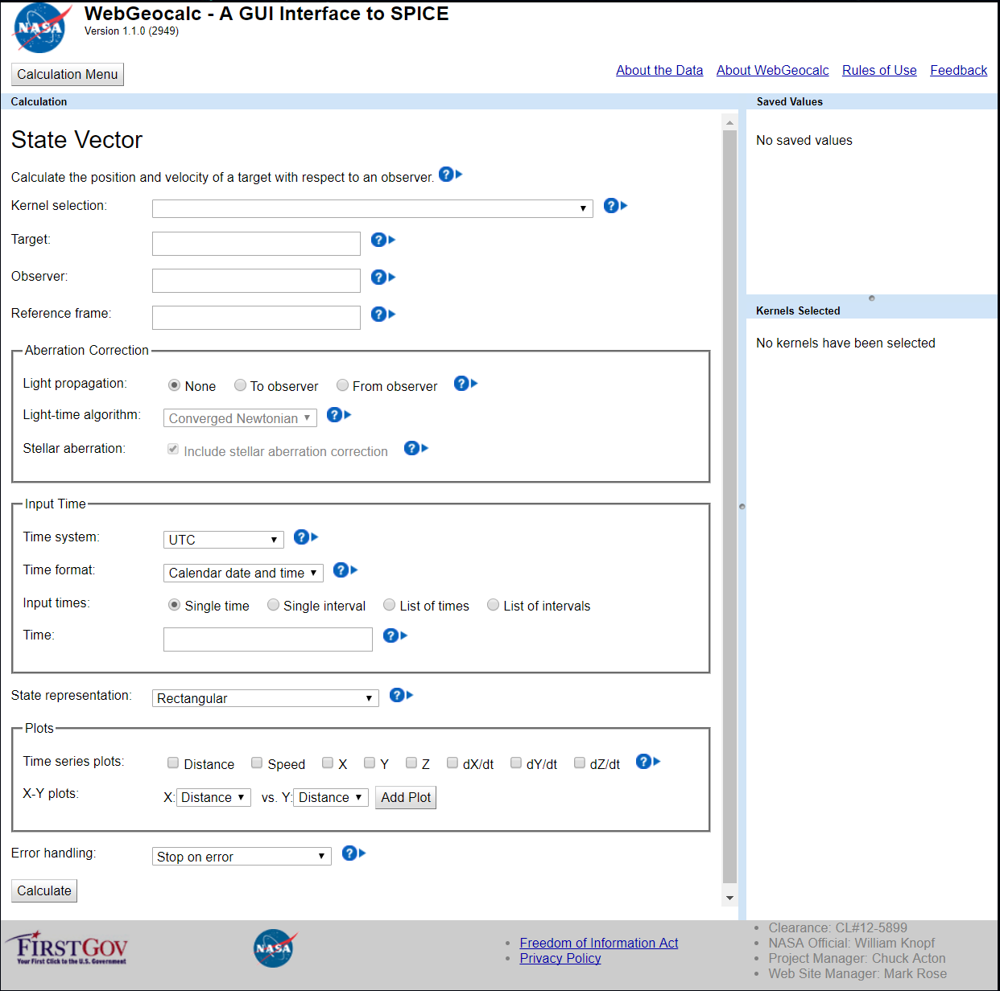

After navigating to the WebGeocalc GUI:

1. Choose the kernel set to be "Cassini Huygens." Hovering the mouse over the
   Cassini Huygens kernel, text is displayed describing an archived kernel
   including a date range from 10/15/97 until 12/31/2016 (at the time this was
   published).
2. The target should be "CASSINI" (not to be confused with "CASSINI PROBE"
   which is the Huygens lander), as this is what we are interested in tracking
   through our reference frame.
3. The observer in our case will be "SATURN" (not to be confused with "SATURN
   BARYCENTER" which includes the center of mass of the Saturnian system) as
   the reference frame in WWT is centered on Saturn's individual center of
   mass.
4. The reference frame should be specified as "ECLIPJ2000," which is the
   standard for most cases.
5. Aberration Correction can be ignored for our purposes.
6. The time system default of "UTC" should be paired with a time format of
   "Julian Date."
7. We want to visualize Cassini's orbital trajectories relative to Saturn
   beginning with its initial orbital insertion in July 1st, 2004 until its
   Grand Finale crash into Saturn's atmosphere in September 15th, 2017. To
   obtain the Julian date, you can visit a convenient converter here (and read
   more about how it is calculated) and we arrive at an interval from 2453188
   to 2458012. It is important to note that noon UTC is the start of a
   specific Julian day.
8. Here I am using a 6 hour time step as the GUI will only process up to
   25,000 data points at once, but a using 1 hour or less time step is
   preferred for smooth lines in WWT. Multiple intervals can be calculated in
   separate runs to create a larger data set.
9. State representation should be "Rectangular" coordinates.
10. Plots can also be ignored for our purposes (but can be good for
    troubleshooting).
11. Press calculate! (and expect errors, which we'll fix below)

The form should look like the following:

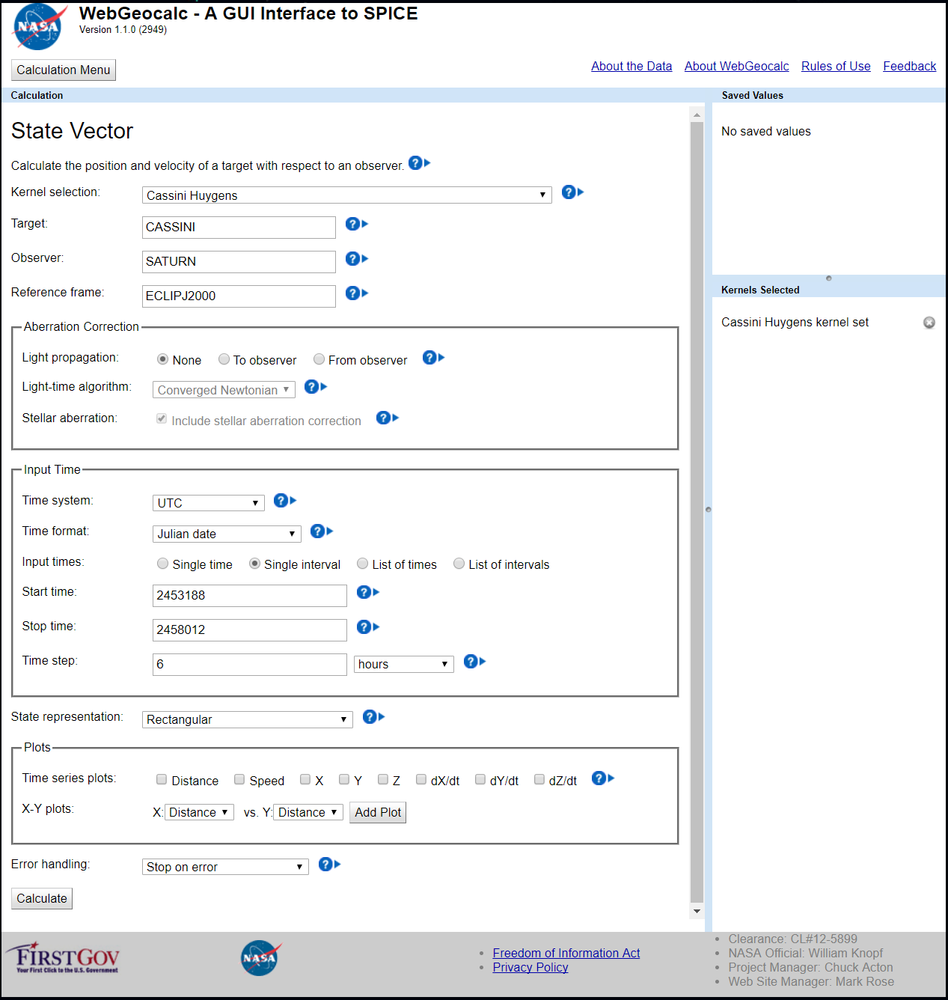

Upon calculation, there may be errors pertaining to insufficient data within
the desired timeframe. The archived data is usually does not contain the most
current data available, but this can be loaded manually.

1. Go back to the top and under Kernel Selection, click "Manual."
2. "Choose Kernels" and navigate to "CASSINI/kernels/spk" and you will be
   presented with an assortment of confusing filenames of various extensions.
3. The readme file can be found here and sheds great insight into the naming
   convention that the Cassini team uses for their ephemeris data (something
   that often varies by mission). Files produced after May 2003 (which are
   what we want) follow the naming convention:
   `[DeliveryDate][V][T]_[Description]_[StartEvent]_[EndEvent].[Ext]` where:
   - `[DeliveryDate]` is the approximate date that the file was delivered in
     YYMMDD format
   - `[V]` is the file version: optional, or may be `A`, `B`, etc.
   - `[T]` is the type of data in the file: optional, `P` for predicted
     trajectory, or `R` for reconstructed trajectory.
   - `[Description]` is the file description:
     - `SK` for orbiter spacecraft trajectory SPK file
     - `OPK` for orbiter and probe trajectory SPK file
     - `PE` for planetary ephemeris SPK file
     - `SE` for major satellite ephemeris SPK file
     - `RE` for minor satellite ephemeris SPK file
     - `IRRE` for outer irregular satellite ephemeris SPK file
     - `SCPSE` for a merged spacecraft, planetary, and satellite ephemerides
       file
   - `[StartEvent]` is the identifier of the file coverage start event,
     consisting of `YY` and `DOY` where `YY` is the last two digits of the year
     and `DOY` is the day of the year. May be `NA` for "not applicable".
   - `[EndEvent]` idenifies the fole coverage end event, in the same format as
     `[StartEvent]`.
   - `[Ext]` is the standard SPICE extension for SPK files: `bsp` for binary
     SPK files; `xsp` or `tsp` for transfer format SPK files.

 We are interested in descriptions that use "SK" for orbiter spacecraft
 trajectories and start and end events that begin with "17" for the year 2017.
 The last file should read "17258" for end event indicating September
 15, 2017. It is handy to use the delivery date as a means to find the more
 newly released data sets. The file extension should be ".bsp" not ".bsp.lbl"
 or other options.

1. Select Cassini SK kernels from 2017 as depicted below.
2. In the Kernel File Browser, navigate to `pds/wgc/mk` and load the latest
   `solar__system__v****.tm` file (`solar__system__v0024.tm` at the time of
   writing).

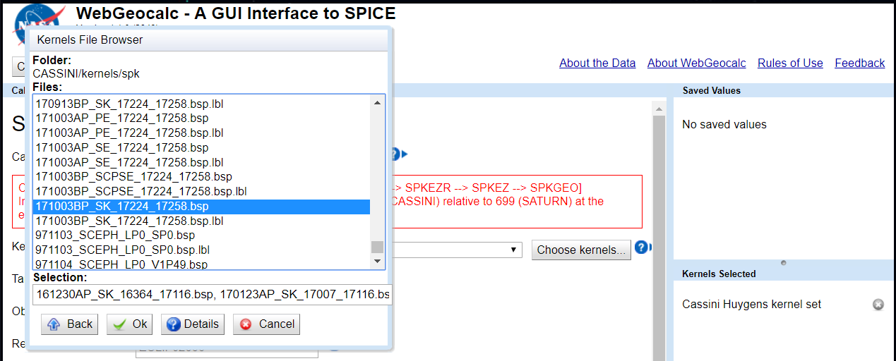

These should populate the right side of the screen after loaded:

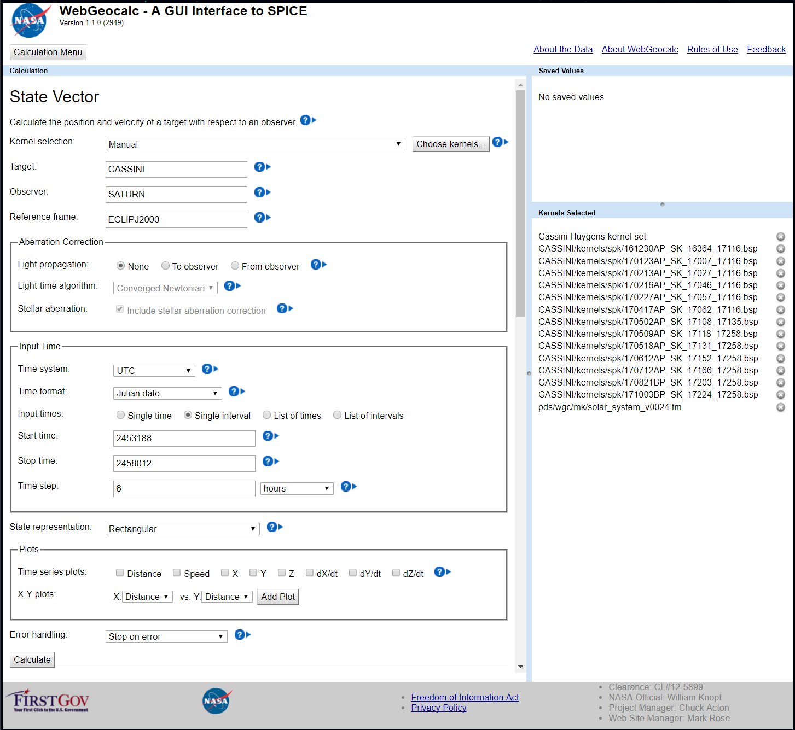

Calculate and troubleshoot errors if necessary. Download the results (I like
to use the Excel file version) and then open in Excel. It should look like
19,297 rows of this:

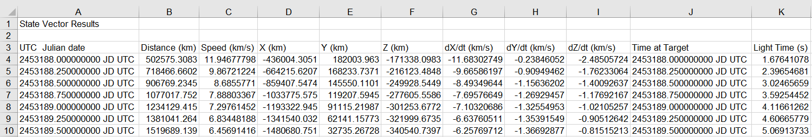

We need columns A, D, E, and F.

1. Copy those 4 full columns (without headings/labels) into a second excel
   sheet (the first excel sheet is not irrelevant) and using Find and Replace
   (CTRL-F): Replace All `JD UTC` with "" (nothing).
2. Save this new excel sheet as a text file `Cassini.txt`
3. Navigate through the file manager in your computer to this newly created
   text file and change the file extension from `.txt` to `.xyz`. Ensure that
   file extensions are shown in the file manager and that you edit the
   extension rather than simply the name. This could result in `Cassini.txt`
   renamed as `Cassini.xyz.txt` (which will not work, and will not be visible
   if file extensions are hidden) instead of `Cassini.xyz` (which will work).
4. Open AAS WorldWide Telescope and right click on Saturn within the Layer
   Manager on the left side of the screen.
   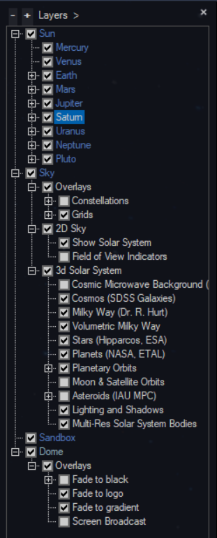
5. Click "New Reference Frame" (this can be created for any of these celestial
   bodies for future data importation). The following Reference Frame Wizard
   will pop up. Name the new reference frame and change the offset type to
   "Trajectory."
   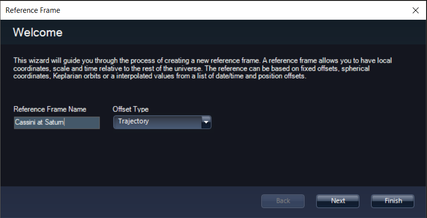
6. Clicking "Next" brings you to the following menu. I recommend choosing the
   color as lime green as it is easy to see and can be modified later, if
   desired. Check the boxes to show the reference frame as a point in the
   distance (easy to find) and to show the orbit path (even easier to find).
   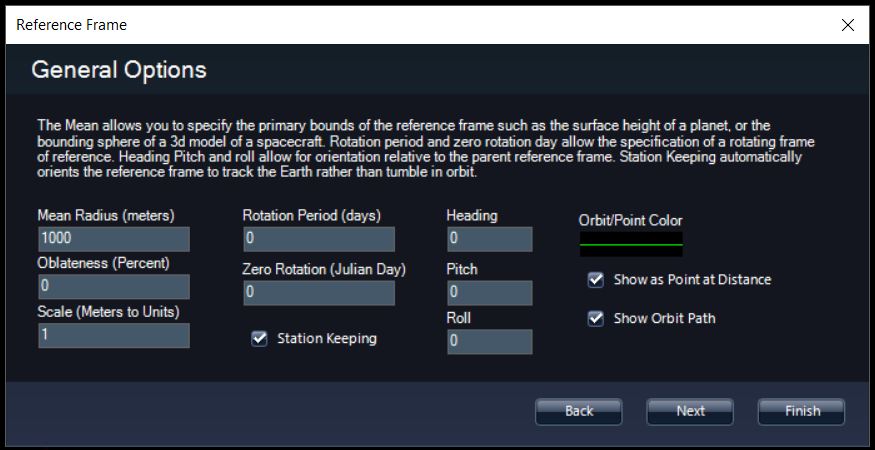
7. The last menu allows you to import the trajectory path that we labored to
   create thus far. Simply click import path and navigate to the `Cassini.xyz`
   file. Be sure to specify "Kilometers" as the units and click finish.
   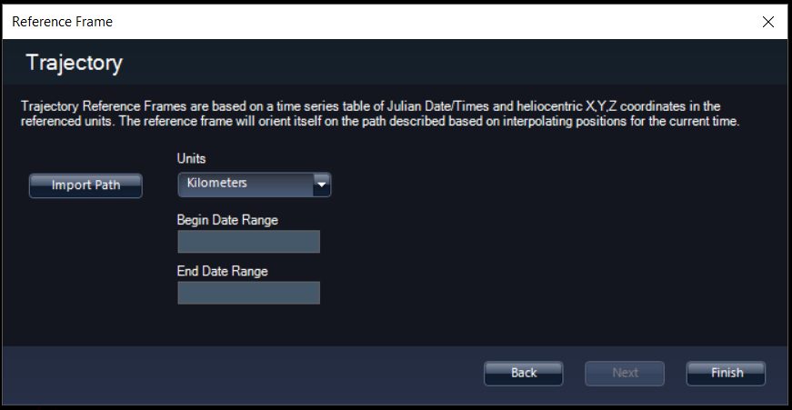

Here is the finished product! Note in the picture below, "Moon & Satellite
Orbits" must be checked on in the Layer Manager and then I have turned off
each of Saturn's moons by checking them in the Layer Manager (children of the
Saturn reference frame). Zooming in, one might find jagged/rough lines that
run through the rings of Saturn. This can be fixed by creating a layer with
more data points and a smaller time step (1 hour or less). Be sure to save
your layers (they will not stay otherwise) by right clicking on the layer in
the layer manger and clicking "Save Layers."

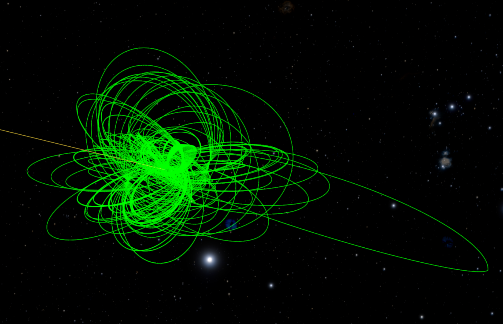

Taking a step further, I've separated the Cassini orbits into color coded sub
missions:

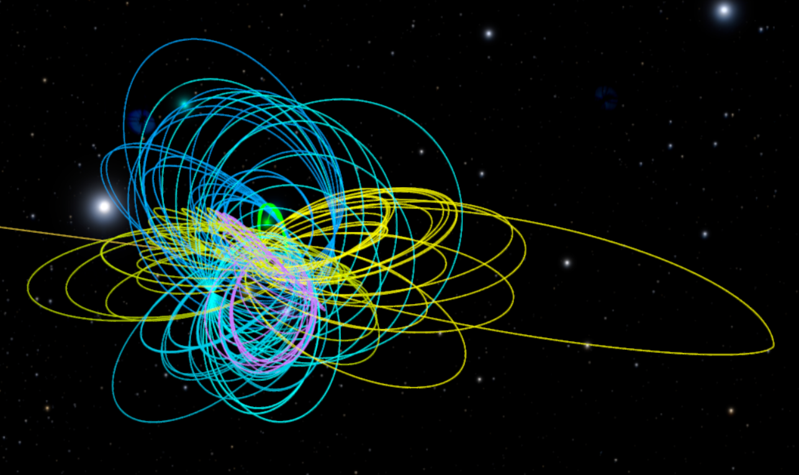

Take it another step and modify the input into the WebGeocalc GUI to visualize
Cassini's orbit relative to the Sun from launch until orbital insertion or try
out any number of different satellites!
