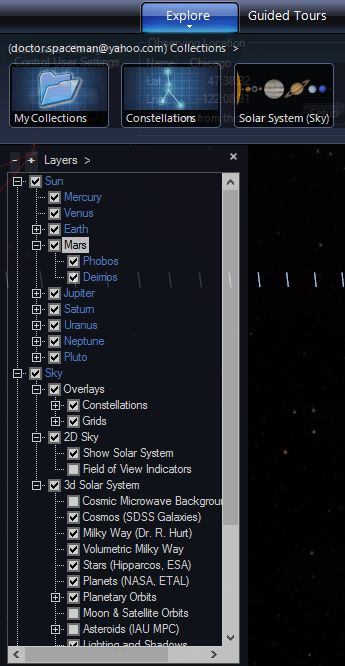
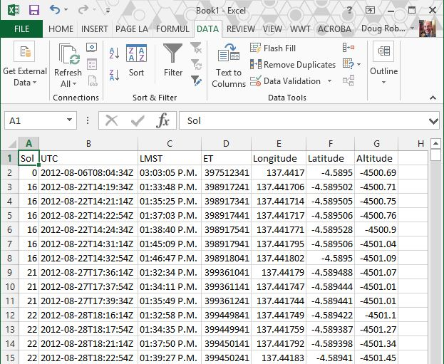
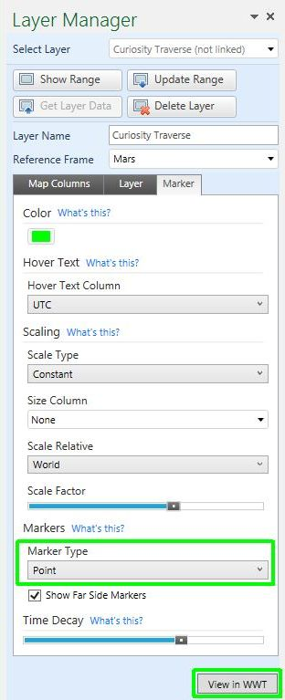
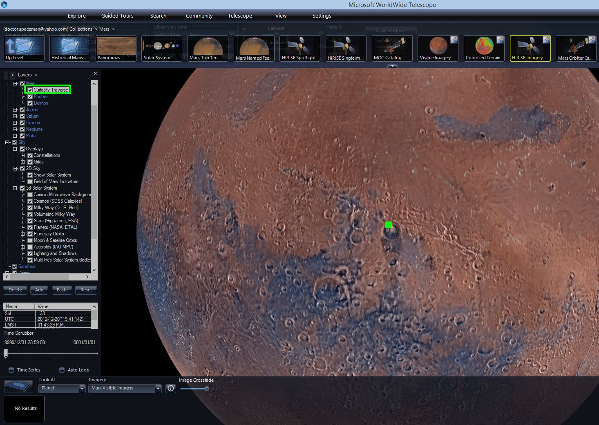
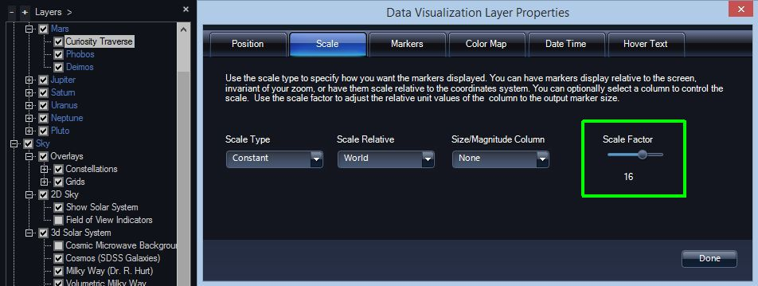
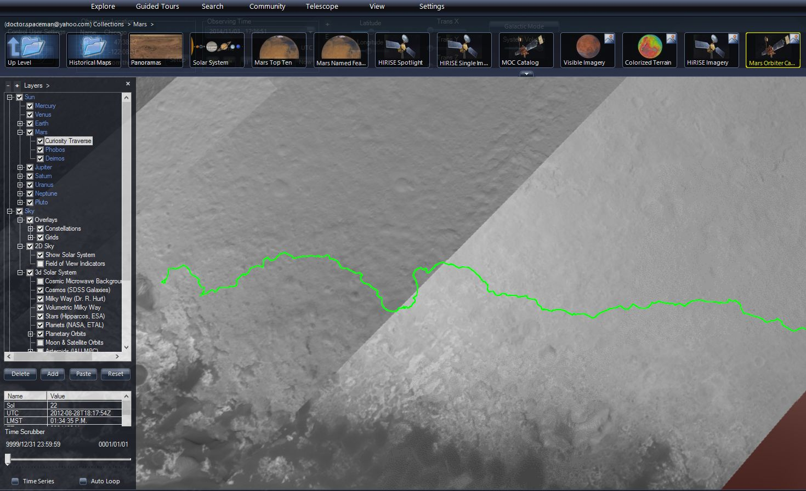

+++
title = "Excel Example: Traverse Trails"
weight = 500
+++

*Tutorial contributed by A. David Weigel, Christenberry Planetarium, Samford University.*

In this section we demonstrate how to create a layer that displays the
traverse trail of the Curiosity rover on Mars within Gale Crater towards
Aeolis Mons (Mt Sharp). The Layer Manager is located in the lower left of the
screen and can be toggled on/off.

Within the Layer Manager, you can check boxes on and off to show the different
visualizations that are built into WWT. Expanding the **Earth** menu will show
six children layers, including **Overlays**, the **Moon** and the **ISS**.
Likewise for **Mars**, the only options are **Phobos and Deimos**.

1. To create our own layer for Mars, we first need to ensure that the
   WWT Excel Add-In is installed for your computer, which can be found
   here: [http://www.layerscape.org/Home/ExcelAddInWelcome.](http://www.layerscape.org/Home/ExcelAddInWelcome)
1. Curiosity traverse coordinates courtesy of Joe Knapp can be found at
   [curiosityrover.com](http://curiosityrover.com/rovertrackfine.json).
1. Right-click and **Save As** to save the file `rovertrackfine.json`. Open
   the file with Microsoft Word and use **Replace** (Ctrl-H) to replace the
   following characters in the JSON file with nothing: `[`, `]`, `{`, `},`,
   `}`. Save As a plain text file and ignore all prompts that formatting will
   be lost in doing so.
   
1. Open **Microsoft Excel** and click **DATA/From Text**. Import the plain
   text file just saved from Word. In the Text Import Wizard, choose
   **Delimited** (default choice) and start import at row 2 if there is an
   empty row at the beginning of the data. In step 2, check the delimiter
   boxes for **Comma** and **Other** and in the Other box, type in a colon
   (:). Step 3 can be skipped and click Finish.

Once imported, add a row at the beginning of the spreadsheet and label the
columns with the appropriate labels (column B will be labeled Sol, and etc.).
After labeling, delete the columns that only consist of labels (every other
column).

1. Be sure to Save As and Excel Workbook and it should look something like this.

   

   * **Sol** is the number of Martian day since landing (0).
   * **LMST** is Local Mean Solar Time.
   * **ET** is ephemeral time, or seconds elapsed since 1/1/2000, so
     subtracting ET at landing (Sol 0) from another data point gives elapsed
     mission time in seconds.
   * **Longitude and Latitude** are from a reference point that is defined
     with WWT.
   * **Altitude** is the elevation of the rover with respect to datum,
     essentially sea level for Mars.
1. Now, open **WorldWide Telescope**, go back to Excel and click on the
   **WWT** heading. Control-A selects all data and then click **Visualize
   Selection**. We are only interested in the **Longitude, Latitude and
   Altitude** which are automatically mapped to their respective columns in
   the table.
   
1. Change the **Layer Name** to **Curiosity Traverse**.
2. Change the **Reference Frame** to **Mars** (from Earth). Make sure the WWT
   Label matches the highlighted data and that the distance is in meters.
3. Under the **Marker** tab change the color to lime green (shows up very well
   on Mars and is my favorite color). **Hover Text** should be none, **Scale
   Type** Constant, and **Scale Factor** can start at 1 or larger (it will be
   easy to find if its bigger and you don’t know where Gale Crater is located
   off the top of your head). Eventually we will want to change the Scale
   Factor to the smallest scale but we can do this through the layer property
   editor in WWT. **Marker Type** should be Point.
4. Finally click **View in WWT**.
   

In WWT you should see the **Curiosity Traverse** layer as a child of Mars (if
not, check to make sure it isn’t under Earth, in which case you need to adjust
the reference frame in Excel). Make sure the layer is turned on and find Gale
Crater, you will see a large green marker.

1. You can now turn down the scale all the way by right clicking the
   **Curiosity Traverse** layer and selecting **Properties**. Under the
   **Scale** tab, slide the **Scale Factor** to a number like 0.003 or lower.

1. Now from the **Explore/Collections/Mars** at the top of WWT, right click
   **Mars Orbiter Camera Imagery** and select **Add as New Layer** (be sure
   that it becomes a child of Mars). Right-click the layer and click
   **Background Image Set**. Now the rover traverse map in overlaid on a
   higher resolution set of images of Gale Crater.

