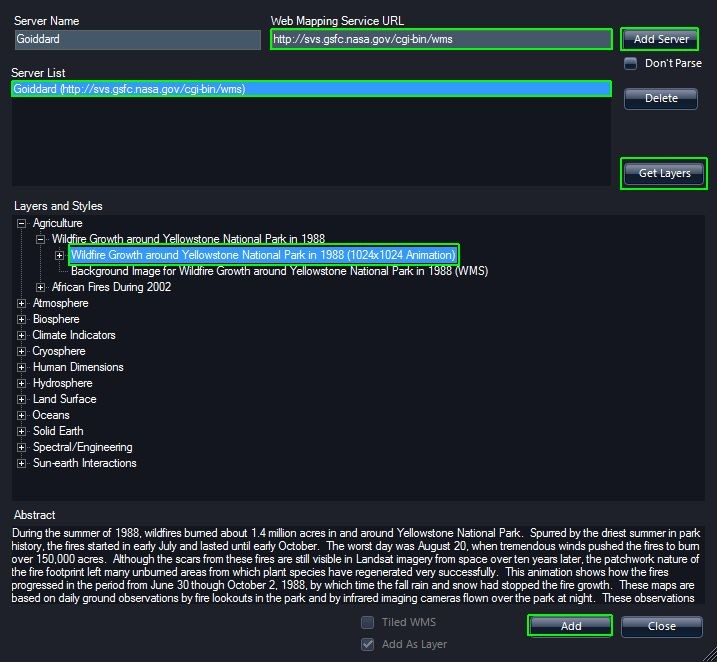
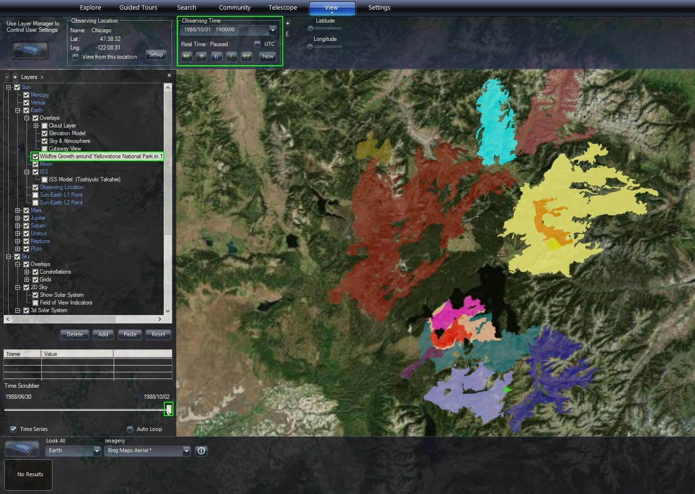

+++
title = "Web Mapping Service (WMS) Data"
weight = 400
+++

WWT can read Web Mapping Service (WMS) data from various data services. WMS
data are served by various sources, and often show time-varying map overlays
which can be displayed on the Earth or planets. In the example below, we will
add a time-sequence of WMS maps showing wild fires in Yellowstone, but a
similar process would be used to add other mapping data for other planets.

1. In the Layer Manager, under the Sun, right-click on the Earth and select
   "New WMS Layer" to bring up the WMS wizard.
2. In this example, we will use the default server at NASA Goddard Space
   Flight Center, which is identified by the Web Mapping Service URL field
   <http://svs.gsfc.nasa.gov/cgi-bin/wms>. You could also enter a URL from the
   list below or construct your own list to choose from. Set the “Server Name”
   to something like “Goddard” and click the "Add Server" button to add this
   to your Server List.
3. Click on “Goddard”, and then click the “Get Layers” Button receive a list
   of available layers.
4. Data providers categorize WMS data; for this example, expand – by pressing
   the “+” to the left of “Agriculture,” and then further expand the “Wildlife
   Growth around Yellowstone National Park in 1988” to show “Wildlife Growth
   around Yellowstone National Park in 1988 (1024x1024 Animation).”
   
6. Then press the “Add” button in the lower right. Close the dialog box by
   clicking “Close” to the right of “Add” button. Now in the Layer Manager
   under Sun/Earth, there is a layer entitled “Wildlife Growth around
   Yellowstone National Park in 1988 (1024x1024 Animation).”
7. Since these data represent a time sequence as you scrub through time in the
   SolarSystem mode, the lighting and Earth rotation will change as well and
   you will not view the same location on the Earth as time changes. To be
   able to scrub through time, you should Look At: Earth.
8. Make sure the checkbox next to “Wildlife Growth around Yellowstone National
   Park in 1988 (1024x1024 Animation)” under Sun/Earth in the Layer Manager is
   checked.
9. Find Yellowstone National Park on the Earth.
10. Move the Time Scrubber, which is shown below the Layer Manager. You will
    see a sequence of different maps. Note, the colors are chosen by the WMS
    data provider and you should go to the data source to find out what the
    color represent. Note, that as you move the Time Scrubber, Observing Time
    in the View tab also shows the detailed time/date.

# Resources

Here are some WMS sources to check out:

- [NASA GSFC](http://svs.gsfc.nasa.gov/cgi-bin/wms)
- [MBARI](https://erddap.mbari.org/erddap/wms/)
- [GIBS](http://map1.vis.earthdata.nasa.gov/twms-geo/twms.cgi)
- [NEOWMS NASA SCI](http://neowms.sci.gsfc.nasa.gov/wms/wms)
- [NASA WorldWind](https://worldwind.arc.nasa.gov/)
- [NASA Earth Observatory](http://neowms.sci.gsfc.nasa.gov/wms/wms)
